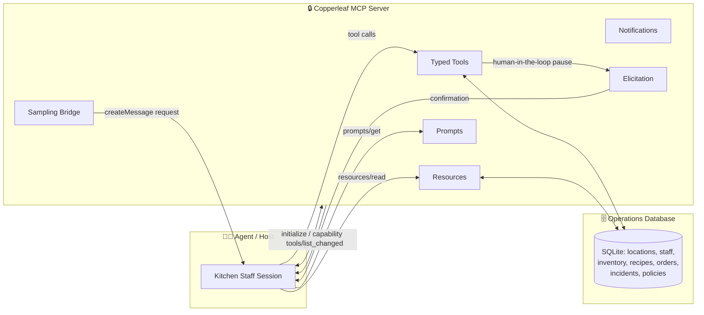
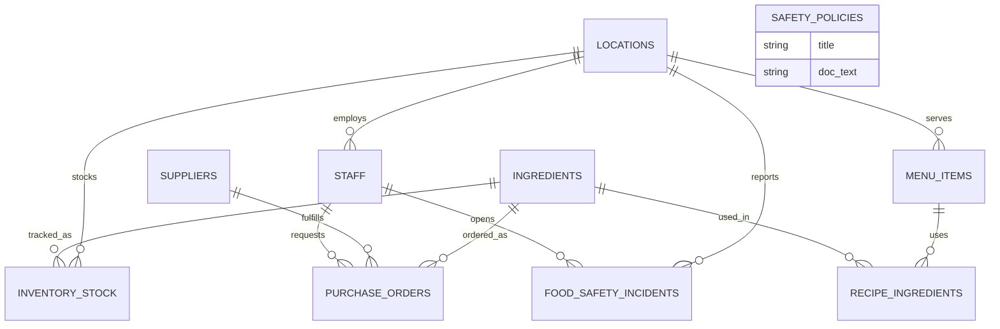

<div align="center">

# 🥕 Copperleaf A | Kitchen Operations MCP Server

### Safe, Scoped, Human-Supervised LLM Access to Restaurant Operational Data

[](https://modelcontextprotocol.io)
[]()

[]()
[]()

*Turning kitchen chaos into safe, natural-language operations — one scoped tool call at a time.*

</div>

---

## 📖 Table of Contents

- [🏢 Company Overview](#-company-overview)
- [📜 Company Story](#-company-story)
- [🚨 The Problem](#-the-problem)
- [🤔 Why an MCP Server?](#-why-an-mcp-server)
- [🏗️ Project Architecture](#️-project-architecture)
- [🗃️ Database & ERD](#️-database--erd)
- [🔌 MCP Protocol Concerns in Action](#-mcp-protocol-concerns-in-action)
- [✨ System Features](#-system-features)
- [📂 Repository Structure](#-repository-structure)
- [🛠️ Technologies Used](#️-technologies-used)
- [👥 Team Deliverables](#-team-deliverables)
- [🚀 Future Improvements](#-future-improvements)
- [📄 License](#-license)

---

## 🏢 Company Overview

**Copperleaf A** builds intelligent, trustworthy AI systems for the restaurant industry. We believe kitchens generate some of the messiest, highest-stakes operational data in any business — inventory, allergens, supplier relationships, food-safety compliance — and that this data deserves AI tooling built with the same rigor as a health inspector, not the looseness of a chatbot demo.

Our mission: give restaurant teams natural-language access to the systems they already run on, without ever letting a model act outside its lane.

---

## 📜 Company Story

Copperleaf A started by building conversational AI for the front of house — a customer support agent that helped diners get answers about menus, reservations, and orders. That work taught us something important: the moment you connect a language model to real operational systems, *guardrails matter more than fluency*.

As we talked to more restaurant groups, we kept hearing the same story from the back of house instead of the front: kitchen managers drowning in spreadsheets, line cooks improvising reorders, allergen information scattered across laminated cards, and food-safety incidents logged on paper and escalated only if someone remembered to make a phone call.

So we evolved. The same discipline we brought to customer-facing conversation — scoping what a model is allowed to say and do — is exactly what a restaurant's *operational* data needs, except the stakes are no longer "did the bot answer politely." They're **food safety, allergen accuracy, and real money moving through purchase orders.**

That shift in stakes is why this project exists: **Copperleaf A's Kitchen Operations MCP Server.**

---

## 🚨 The Problem

Our customer, **Copperleaf** — a multi-location restaurant group with a shared commercial kitchen supplying ingredients and prepped components across sites — runs on a patchwork of manual processes:

| Pain Point | Current Reality |
|---|---|
| 📊 Inventory | Tracked in spreadsheets, updated inconsistently |
| 🛒 Reordering | Placed by "whoever notices stock is low" |
| ⚠️ Allergen info | Scattered across printed recipe cards |
| 🔥 Food-safety incidents | Logged on paper, escalated only if someone remembers to call |
| 🔐 Access control | None — a line cook can place a large supplier order or read another location's financials |

Kitchen managers, line cooks, purchasing staff, and a dedicated food-safety officer all touch the same underlying data — with no consistent structure, no audit trail, and no boundaries.

Copperleaf wants staff to be able to ask questions like:

> *"What's low on stock at the downtown kitchen?"*
> *"Does the shrimp risotto contain shellfish?"*
> *"Draft a response to yesterday's health inspection."*

instead of digging through spreadsheets and printed cards.

---

## 🤔 Why an MCP Server?

> [!WARNING]
> Wiring an LLM directly into Copperleaf's operations database is a liability, not a feature. A hallucinated or manipulated tool call could place an unbudgeted purchase order, misreport an allergen, or silently close out a food-safety incident with no human ever reviewing it.

The **Model Context Protocol (MCP)** lets us put a disciplined boundary between the model and the data:

- ✅ Expose only **scoped, typed tools, resources, and prompts** — never raw database access
- ✅ Keep **money- and safety-critical writes** behind role checks and mandatory human confirmation
- ✅ **Change what an agent can do at runtime** as a staff member's role or an incident's state changes
- ✅ Route reasoning-heavy work (like drafting an incident summary) through **sampling**, not a server-side model with no oversight

This is what separates "an LLM that can technically call our database" from "an LLM we trust to operate near food safety and payroll-adjacent spend."

---

## 🏗️ Project Architecture

<details>
<summary><strong>🔎 Click to expand: high-level architecture diagram</strong></summary>



</details>

**Core design principle:** the model never talks to the database directly. Every read goes through a typed tool or resource; every write is validated server-side and, where the stakes are high, gated on explicit human confirmation.

---

## 🗃️ Database & ERD

The operations database has **10 tables** modeling a multi-location kitchen group.

<details>
<summary><strong>🔎 Click to expand: Entity Relationship Diagram (Mermaid)</strong></summary>



</details>

### Schema Reference

| Table | Key Fields | Notes |
|---|---|---|
| `locations` | `location_id` PK, `name`, `region`, `monthly_budget` | Budget drives purchase-order checks |
| `staff` | `staff_id` PK, `name`, `role`, `location_id` FK | Roles: `line_cook`, `kitchen_manager`, `food_safety_officer` |
| `menu_items` | `item_id` PK, `name`, `location_id` FK, `price` | One row per dish per location |
| `ingredients` | `ingredient_id` PK, `name`, `allergen_tags` | Tags: shellfish, nuts, dairy, gluten... |
| `recipe_ingredients` | `item_id` FK, `ingredient_id` FK, `quantity` | Junction table defining dish composition |
| `inventory_stock` | `stock_id` PK, `ingredient_id` FK, `location_id` FK, `qty_on_hand`, `reorder_threshold` | Seeded with normal and low-stock cases |
| `suppliers` | `supplier_id` PK, `name`, `verified`, `contact` | `verified`: pre-approved by procurement |
| `purchase_orders` | `po_id` PK, `ingredient_id` FK, `supplier_id` FK, `qty`, `cost`, `status`, `requested_by` FK | `status`: pending / approved / rejected |
| `food_safety_incidents` | `incident_id` PK, `location_id` FK, `type`, `opened_by` FK, `status`, `summary` | `summary` populated via sampling |
| `safety_policies` | `policy_id` PK, `title`, `doc_text` | Standalone reference data — a **resource**, not a tool |

> [!NOTE]
> `safety_policies` is intentionally **not** linked by foreign key to anything else — it's reference documentation (like the HACCP temperature-log procedure) exposed via `resources/read`, not an operational record.

---

## 🔌 MCP Protocol Concerns in Action

Every core MCP capability is demonstrated with a real, food-safety-or-money-relevant use case — not a toy example.

### 🤝 Capability Negotiation
On `initialize`, the server declares exactly which capabilities it supports (elicitation, sampling, resources, prompts, notifications). A client without elicitation support simply never gets offered the over-budget confirmation path on `place_purchase_order` — the server adapts to what the client can actually handle.

### 📚 Resources
`safety_policies` (e.g. the HACCP Cold Holding Temperature Procedure) and a derived allergen matrix (menu item → allergen tags) are exposed via `resources/list` / `resources/read`. This is data the model should *read and reason over*, not call with arguments — and it always reflects the current value, since it isn't hardcoded into a prompt.

### 💬 Prompts
Two reusable prompt templates are exposed for the host to surface directly:
- `draft_supplier_dispute_email {po_id}`
- `draft_health_inspection_response {incident_id}`

### 🧠 Sampling
When a food-safety incident opens, the server issues a `sampling/createMessage` request so the **client's model** — not a model the server calls on its own — drafts a plain-language incident summary from raw temperature-log readings. That summary is stored on the incident.

### 🔔 Notifications
A `line_cook` session starts with read-only tools only. The moment a `food_safety_incidents` row opens at a location (e.g. a fridge temperature breach), the server pushes `tools/list_changed`, and `log_corrective_action` / `close_incident` appear live for the `food_safety_officer`'s session — no reconnect required.

### ✋ Elicitation (Human-in-the-Loop)
`place_purchase_order` pauses with a genuine `elicitation/create` call whenever an order exceeds 80% of a location's remaining budget, or targets an unverified supplier. The final outcome — placed or not — is gated entirely on the human's response; nothing is silently applied or silently dropped.

### 📈 Progress Tracking
`run_inventory_audit` walks a location's full ingredient stock in batches, reporting real intermediate progress rather than blocking silently until the whole audit finishes.

### 🛡️ Defensive Tool Design
`place_purchase_order` doesn't stop at JSON Schema constraints on `quantity` and `supplier_id`. The server independently re-validates order cost against the location's remaining `monthly_budget`, and enforces a handler-level check that the calling session's role is `kitchen_manager` — a well-formed call from a `line_cook` session is rejected regardless.

### 🚚 Transport
The server ships first over **stdio** for local development, then transitions to **Streamable HTTP** behind auth once the core behaviors are stable — with commit history that visibly shows the transition, not just the end state. A multi-location chain needs HTTP in production; stdio is a local dev convenience.

---

## ✨ System Features

- 🔍 Natural-language inventory and allergen lookups across locations
- 🛒 Guarded purchase ordering with budget- and role-aware validation
- 🚨 Live-updating tool access as food-safety incidents open and close
- 🧾 AI-drafted incident summaries and correspondence, always human-reviewable
- 📋 Structured, always-current access to safety policy documentation
- 📊 Batch-based progress reporting for long-running operational audits

---

## 📂 Repository Structure

```
copperleaf-mcp-server/
├── db/                     # Schema, seed data, ERD (owned end-to-end by Person 1)
│   ├── schema.sql
│   ├── seed.sql
│   └── erd.mmd
├── mcp_server/              # Core MCP server implementation
│   ├── tools/                # get_inventory_level, place_purchase_order, run_inventory_audit, ...
│   ├── resources/             # safety_policies, allergen matrix
│   ├── prompts/               # draft_supplier_dispute_email, draft_health_inspection_response
│   └── transport/             # stdio + Streamable HTTP
├── agent/                   # End-to-end client wiring every tool/resource/prompt together
└── README.md
```

---

## 🛠️ Technologies Used

| Layer | Technology |
|---|---|
| Protocol | Model Context Protocol (MCP) |
| Database | SQLite |
| Server & Agent | Python |
| Transport | stdio (dev) → Streamable HTTP (production) |
| Diagrams | Mermaid |

---

## 👥 Team Deliverables

| Concern | Owner | Folders Touched |
|---|---|---|
| Capability negotiation | Person 1 | `mcp_server/` |
| Defensive tool design (`place_purchase_order`) | Person 1 | `mcp_server/` |
| Progress tracking (`run_inventory_audit`) | Person 1 | `mcp_server/` |
| Notifications (`tools/list_changed`) | Person 2 | `mcp_server/`, `agent/` |
| Elicitation (`place_purchase_order` over budget) | Person 2 | `mcp_server/`, `agent/` |
| Sampling (incident summary) | Person 2 | `mcp_server/`, `agent/` |
| Resources (`safety_policies`, allergen matrix) | Person 3 | `mcp_server/`, `agent/` |
| Prompts (dispute email / inspection response) | Person 3 | `mcp_server/`, `agent/` |
| Transport (stdio → Streamable HTTP) | Person 3 | `mcp_server/`, `agent/` |

**Database ownership:** Person 1 owns `db/` end-to-end. Person 2 and Person 3 never edit `db/` directly — schema changes go through an issue against Person 1, keeping one source of truth for the data layer.

<details>
<summary><strong>🔎 Click to expand: Suggested Timeline</strong></summary>

| Milestone | Focus |
|---|---|
| **1 — Foundation** | Schema, seed data, ERD, `initialize` handshake, 3 read tools |
| **2 — Core Behaviors** | `place_purchase_order`, notifications, elicitation, sampling, resources, prompts — each tested in isolation |
| **3 — Integration** | Full agent wiring, stdio → Streamable HTTP transition, `run_inventory_audit` finished |
| **4 — Demo & Polish** | Run all 9 fixed test inputs end-to-end, record transcript, finalize README |

</details>

<details>
<summary><strong>🔎 Click to expand: Fixed Test Inputs (repeatable demo)</strong></summary>

| # | Concern | Fixed Input |
|---|---|---|
| 1 | Capability negotiation | Connect a client with no elicitation support → over-budget path is not offered |
| 2 | Notifications | Open a temperature-breach incident at the downtown kitchen → `tools/list_changed` fires |
| 3 | Elicitation | Call `place_purchase_order` at 90% of remaining budget → test one approve, one reject |
| 4 | Sampling | Incident `INC-1002` opens → `sampling/createMessage` drafts the summary |
| 5 | Resources | Agent reads `safety_policies` for "Cold Holding Temperature Procedure" |
| 6 | Prompts | Host surfaces `draft_health_inspection_response` for `INC-1002` |
| 7 | Transport | Local demo over stdio; README + commit log show the later HTTP version |
| 8 | Progress tracking | `run_inventory_audit` over the downtown kitchen's full stock reports progress every batch |
| 9 | Defensive tool design | `place_purchase_order` called above budget, and by a `line_cook` session — both rejected |

</details>

> [!TIP]
> **Ground rules:** one GitHub Issue per concern per person (problem, constraint, acceptance criteria — not just a task name), branch-per-issue with PR review, no `db/` edits outside Person 1, every write tool schema requires `required` fields and `additionalProperties: false`, and no credentials ever committed (`.env` + `.gitignore` from day one).

---

## 🚀 Future Improvements

- 🌐 Multi-tenant support for restaurant groups beyond Copperleaf
- 📱 Mobile-first interface for kitchen-floor staff
- 🔐 Fine-grained, per-tool audit logging for compliance reviews
- 🤖 Predictive reorder suggestions based on historical consumption patterns
- 🌡️ Direct IoT integration for real-time fridge/freezer temperature monitoring

---


<div align="center">

**Built with 🥕 by Copperleaf A**
*AI that knows where the line is — and stays behind it.*

</div>
